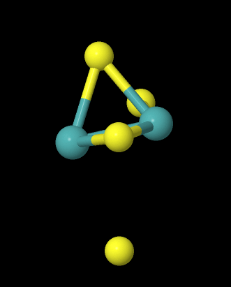
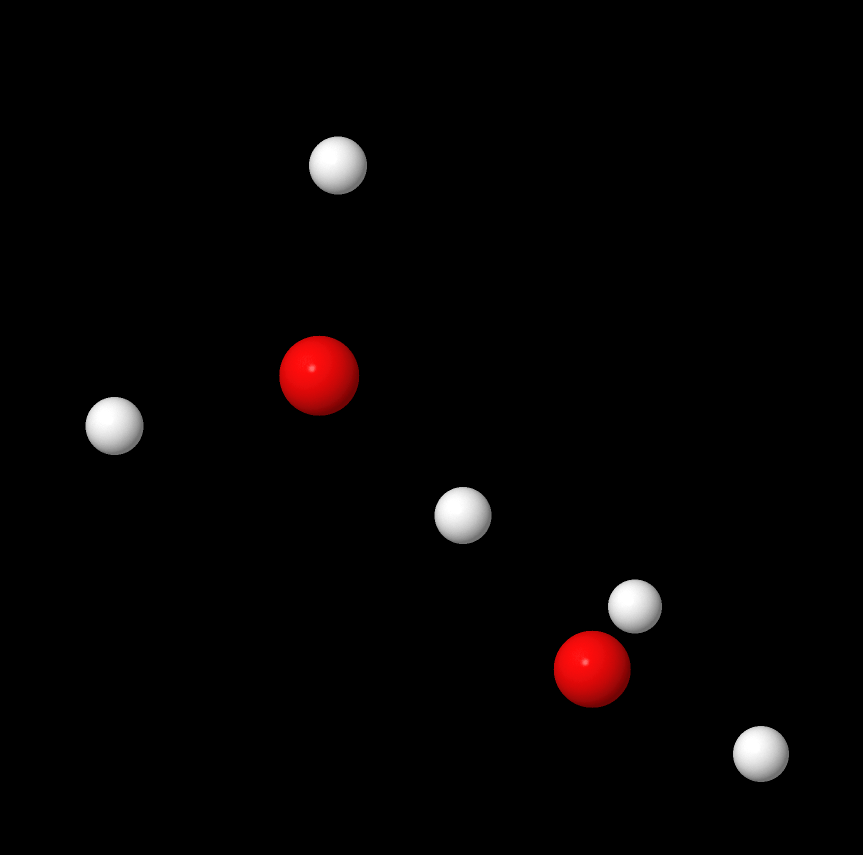

# Molecular Dynamics : AI for Physics

To see the report : [report.pdf](./report.pdf)

## Table of Contents
- [Abstract](#Abstract)
- [Table of Contents](#Table-of-Contents)
- [Data Description](#Data-Description)
- [Methodology](#Methodology)
- [Results](#Results)
- [Conclusion](#Conclusion)
- [References](#References)
- [Requirements and Installation](#Requirements-and-Installation)

## Abstract

This report discusses a project that uses ab initio molecular dynamics simulations to create
predictive models for molecular energy levels. Two datasets are examined: one from simulations
of the Zundel ion (H2O-H-H2O) and another from simulations of a Molybdenum-Sulfur (Mo2S4)
aggregate, each comprising approximately 10,000 atomic configurations, along with their respective potential energy values. The main objective is to integrate this intricate physical data
into models capable of accurately predicting energy levels. To achieve this, Linear and Neural
Network models are employed alongside with Principal Component Analysis (PCA). While the
results are promising for the Molybdenum-Sulfur dataset, challenges arise due to the lack of
suitable descriptors for the Zundel ions, resulting in less favourable outcomes.

## Table of Contents

## Data Description
The atomic configurations are stored in `.xyz` files, with each configuration represented by the element and its x, y, z position. For Mo2S4, the dataset includes 11,001 configurations, and for Zundel ions, 10,000 configurations. Energies are available in `.out` files, with units approximately in the order of eV for Mo2S4 and around Hartree for Zundel ions.



**Figure 1**: First configuration of the Mo2S4 (Molybdenum atoms are represented
in blue and Sulfur atoms in yellow).



**Figure 2**: First configuration of the Zundel dataset (Hydrogen atoms are represented in white and Oxygen in red).

## Methodology
### Models Used
1. **Naive Model**: Serves as a baseline for comparison.
2. **Linear Model**: Employs linear regression to correlate atomic positions with potential energies.
3. **Neural Network Model**: A more complex model with a 3-layer architecture.
4. **Principal Component Analysis (PCA)**: Reduces data dimensionality while retaining significant variance.

### Model Architectures
- The Neural Network uses a 3-hidden-layer architecture (18-18-8 neurons) with ReLU activation for hidden layers and linear activation for the output layer.

## Results
- The models were evaluated using metrics like RMSE, MAE, and Pearson’s correlation coefficient.
- Results show promise for the Mo2S4 dataset, but challenges remain for the Zundel ion dataset due to the complexity of its quantum description.

## Conclusion

This project was aimed at analysing the energies of Zundel and Molybdenum-Sulfur atomic configurations. Starting from analysing the raw data and filtering it, to develop models as Linear and even
more complex as Neural Network. These datasets, being the position of every atom in the molecule,
were then translated to another representation (here Coulomb Matrices). The Principal Component
Analysis described a new space to carry our data and gave us a chance to lower the dimension of it.
To conclude, the results are very promising for the Mo2S4 dataset, reaching a Pearson’s correlation coefficient squared (rpe)
2 = 0.958. However, the Zundel dataset seems to not be easily describe
by the Coulomb Matrix, certainly due to quantum mechanics playing a major role in the energy of a
configuration. A forward task would be to try to describe it with Many-Body Tensor Representation
(MBTR) or Smooth Overlap of Atomic Positions (SOAP) to overcome the lack of interesting results.

## References
1. M. Moog, S. Schaack, F. Pietrucci, and A. M. Saitta, **"Unsupervised exploration of MoS2 nanocluster configurations: structures, energetics, and electronic properties"**, The Journal of Physical Chemistry C, 2019.
2. F. Mouhat, S. Sorella, R. Vuilleumier, A. M. Saitta, and M. Casula, **"Fully quantum description of the Zundel ion: combining variational quantum monte carlo with path integral langevin dynamics"**, Journal of Chemical Theory and Computation, 2017.
3. A. B. Tchagang and J. J. Valdés, **"Prediction of the atomization energy of molecules using Coulomb Matrix and atomic composition in a bayesian regularized neural networks"**, Artificial Neural Networks and Machine Learning – ICANN 2019: Workshop and Special Sessions, 2019.
4. L. Himanen, **"Dscribe: library of descriptors for machine learning in materials science"**, 2022.

## Requirements and Installation

To install, open in console (or Powershell on Windows) and copy : 

````shell
git clone https://github.com/lucasboistay/molecular_dynamics.git
cd molecular_dynamics
````

Then, for good measure, it's always good to make a VirtualEnvironment (check [documentation](https://docs.python.org/3/library/venv.html#how-venvs-work)), if you don't have 
the venv library install on your python, do : 
````shell
python -m pip install virtualenv
````

Then, once it's downloaded :

````shell
python -m venv ./.venv/
./venv/Scripts/activate
````

You are now in the Virtual Environment, but there is no library installed. To get them, install with the command :
````shell
python -m pip install --upgrade pip
pip install -r "requirements.txt"
````

Be careful if you use PyCharm or any other IDE, to use the interpreter found in the .venv/Scripts/python.exe !

Now, you can open and run the notebook
````shell
jupyter notebook main.ipynb
````